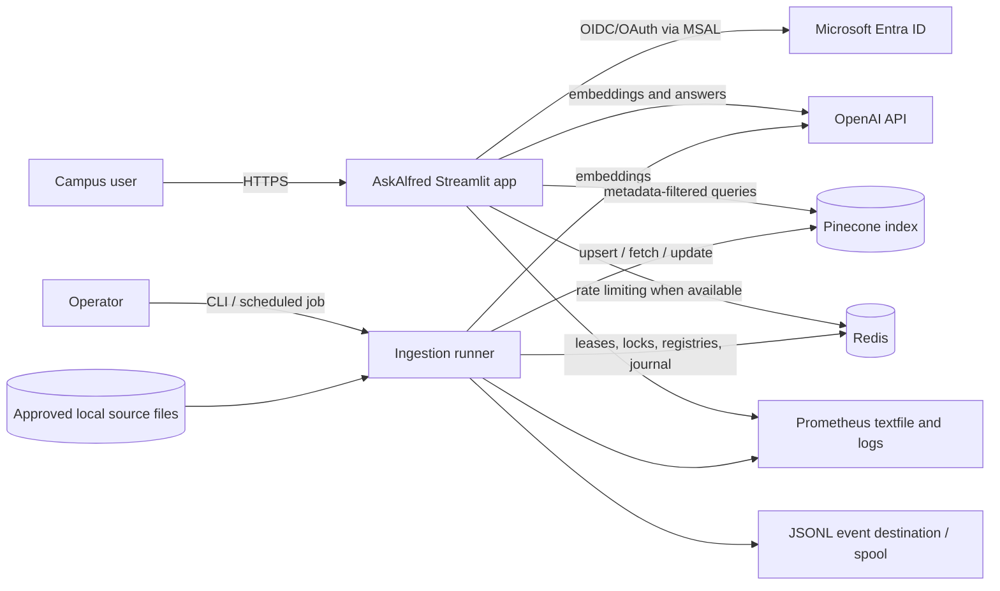
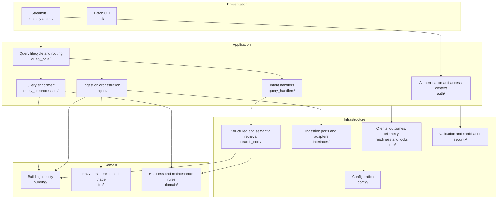
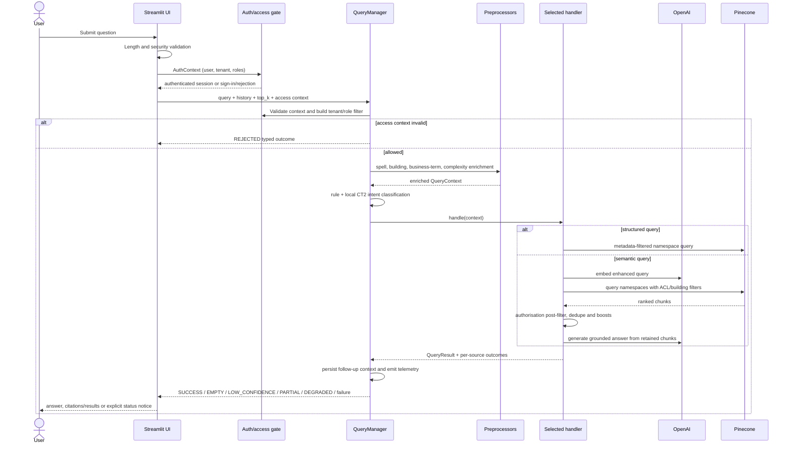
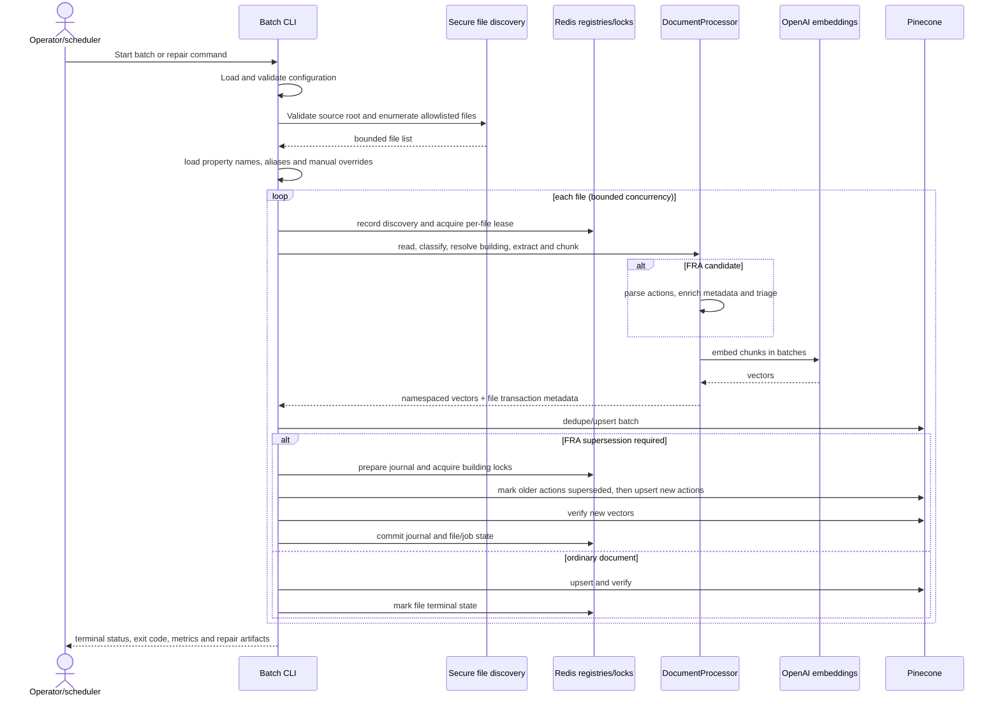
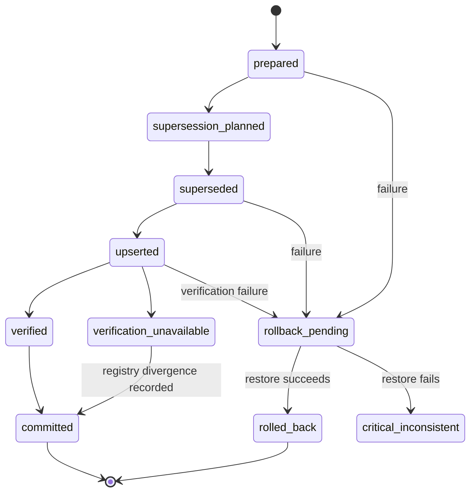
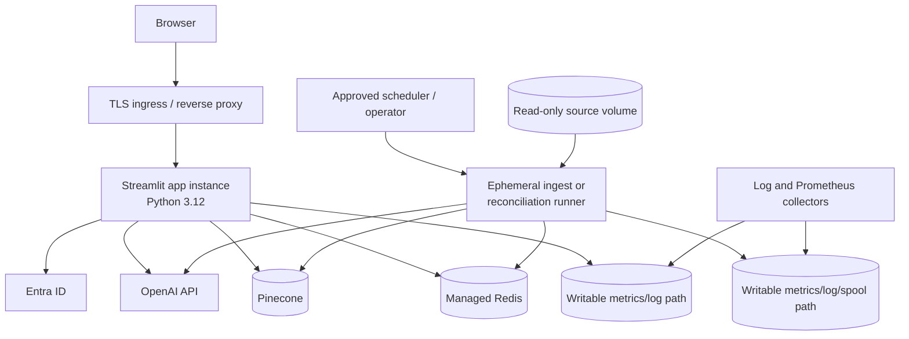

# AskAlfred Architecture Design

Status: implementation-aligned design and production deployment baseline  
Last reviewed: 2026-07-22

## 1. Purpose and scope

AskAlfred is a building-aware search assistant for University of Bristol Campus
Division information. It combines structured queries and retrieval-augmented
generation (RAG) over:

- Planon property data;
- maintenance requests and jobs;
- fire risk assessments (FRAs) and extracted risk actions;
- BMS and other operational documents.

This document describes the architecture implemented in this repository and the
recommended way to deploy it. It covers the interactive query application, the
offline ingestion workload, their shared data contracts, security controls,
failure behaviour, and operational boundaries.

The system is currently a modular Python monolith with two independently invoked
entry points. It is not a set of networked microservices:

- `main.py`: long-running Streamlit query application;
- `cli/local_batch_ingest.py`: finite batch ingestion and reconciliation job.

Keeping these workloads in one codebase makes domain rules reusable, while
running them as separate processes prevents ingestion concurrency and memory use
from affecting interactive queries.

## 2. Architectural drivers

The design prioritises the following qualities, in order:

1. **Access safety** — authenticated retrieval is constrained by tenant and app
   role, and missing access context fails closed before retrieval.
2. **Data integrity** — ingestion is idempotent, tracks per-file state, verifies
   writes, and gives FRA supersession explicit transaction and reconciliation
   semantics.
3. **Truthful failure reporting** — unavailable dependencies and partial source
   failures must not appear to users as a genuine empty result.
4. **Relevant retrieval** — building identity, document type, and business terms
   supplement vector similarity.
5. **Graceful degradation** — the intent classifier, building directory,
   conversation memory, answer generation, and Redis-backed query rate limiting
   have bounded fallback behaviour.
6. **Operability** — terminal outcomes, readiness, low-cardinality metrics,
   durable event spooling, and repair commands expose system health.

## 3. System context

### External dependency classification

| Dependency | Query path | Ingestion path | Responsibility |
|---|---|---|---|
| Microsoft Entra ID | Required when authentication is mandatory | Not used by the batch runner | User identity, tenant and app-role claims |
| OpenAI | Required | Required | Query/document embeddings and generated answers |
| Pinecone | Required | Required | Vector and metadata store |
| Redis | Optional; rate limiting falls back to process memory | Required | File leases, job registry, FRA locks/journal and idempotency |
| Local filesystem | Runtime artifacts only | Required source and artifacts | Approved input files, logs, event spool and metric textfiles |

Startup readiness currently validates dependency *configuration*, not remote
network reachability. Runtime calls therefore remain the definitive liveness
signal for external services.

## 4. Logical architecture

### Module responsibilities

| Area | Primary modules | Responsibility |
|---|---|---|
| Presentation | `main.py`, `ui/` | Authentication UI, chat state, result rendering and operator status |
| Query orchestration | `query_core/` | `QueryContext`, preprocessing, hybrid intent routing, handler execution, cache, typed outcome and conversation-memory lifecycle |
| Intent handlers | `query_handlers/` | Conversational, maintenance, ranking, property, counting and semantic-search behaviours |
| Retrieval | `search_core/` | Structured Planon/maintenance access, semantic search, namespace fan-out, boosting, deduplication and answer generation |
| Building identity | `building/` | Canonical names, aliases, fuzzy resolution, filename/text resolution and Pinecone building filters |
| FRA domain | `fra/` | FRA parsing, metadata extraction, action enrichment, triage scoring and supersession helpers |
| Ingestion | `ingest/` | Secure discovery, extraction, chunking, vector construction, concurrent writes, transactions and reconciliation |
| Infrastructure ports | `interfaces/` | Embedder, vector-store, registries, transaction journal and event-sink contracts plus current adapters |
| Identity and access | `auth/` | MSAL sign-in, credential access, `AuthContext`, ACL creation and defence-in-depth post-filtering |
| Cross-cutting safety | `security/` | Input, file, CSV and log validation/sanitisation plus rate limiting |
| Shared runtime | `core/` | External clients, readiness, outcomes, telemetry, service metrics, Redis locks and session helpers |
| Configuration | `config/` | Environment-backed settings, document-to-namespace routing, source classification and feature flags |

Dependencies should continue to point inward toward application/domain contracts.
The ingestion side already uses explicit ports; extending the same pattern to the
query side would make retrieval and model calls easier to test and replace.

## 5. Interactive query path

### Routing

`QueryManager` owns the complete request lifecycle. Its default handler chain is
ordered as follows:

1. conversational;
2. maintenance;
3. ranking;
4. property condition;
5. counting;
6. semantic search as the mandatory final fallback.

Preprocessors enrich one mutable `QueryContext`; handlers consume it and return a
standard `QueryResult`. Routing combines rules and a local quantised
all-MiniLM-L6-v2 CTranslate2 classifier. If the local model is unavailable, the
classifier falls back to pattern-only routing. A malformed handler graph, rather
than silently dropping a query, returns a typed failure.

### Retrieval and answer generation

Semantic retrieval embeds the enhanced query once per configured embedding model,
then searches all configured Pinecone indexes and namespaces. When a building is
resolved, the first pass applies a building metadata filter; a second unscoped
semantic pass is used only when the first returns no hits. Results are then
deduplicated, boosted for document type/building/occupancy relevance, sorted and
thresholded before answer generation.

Structured handlers query metadata for counting, ranking, property and
maintenance use cases. Both retrieval families receive the same ACL filter and
perform a defence-in-depth authorization check on returned metadata.

Answer-generation failure preserves good retrieval results and returns `PARTIAL`.
A required retrieval-source outage returns `UNAVAILABLE` or `PARTIAL`; it cannot
be converted into `EMPTY`.

### Query state and caching

- Streamlit session state owns chat messages, rolling summary and one
  `QueryManager` per browser session.
- The local intent classifier and building directory are process-wide cached
  resources.
- Follow-up context is held in `SessionManager`, backed by Streamlit session state
  in the app and a module-level fallback in non-Streamlit callers.
- The optional query-result cache is in-process, per `QueryManager`, bounded to
  128 entries and TTL-controlled. Its key includes resolved scope and access
  context. Degraded results are not cached as healthy results.

There is no durable cross-instance conversation or response cache. A production
deployment with more than one app instance therefore needs session affinity, or
conversation state must first move to a shared store keyed by user and session.

## 6. Ingestion path

### Pipeline stages

1. **Configuration and source validation** — API/Redis settings, worker limits,
   file extensions, sizes and the input root are validated before work begins.
2. **Secure discovery** — files are enumerated beneath the approved root; unsafe
   paths and oversized or unsupported documents are rejected.
3. **Building resolution** — a property CSV establishes canonical building names
   and aliases, supplemented by `resolved_buildings.csv` manual overrides.
4. **Extraction and classification** — CSV/XLS-style structured inputs,
   maintenance data, PDFs, DOCX, JSON and text take document-specific paths.
   Ambiguous building-dependent documents are quarantined for review.
5. **Chunking and embedding** — text is token-bounded and embedded in batches.
   CPU-bound extraction/parsing can use a shared process pool.
6. **Vector coordination** — vectors are buffered with backpressure and either
   written inline or through bounded worker threads.
7. **Atomic write and verification** — writes are retried/split as appropriate,
   verified, then reflected in file/job registries.
8. **Outcome publication** — a terminal ingest status maps to a stable exit code;
   metrics, events and reconciliation artifacts record exceptional paths.

Dry-run mode substitutes no-op/in-memory registry and vector adapters and must not
construct OpenAI, Redis or Pinecone clients.

### FRA consistency model

FRA risk actions need stronger semantics because a newer assessment supersedes
older active actions. `FraTransaction` implements a compensating transaction over
systems that do not share a distributed database transaction:

Before mutation, the transaction is durably journalled in Redis and affected
buildings are blocked. Redis locks serialize competing supersessions. New vectors
are verified before commit; failures attempt to restore superseded items. An
incomplete rollback becomes `CRITICAL_INCONSISTENT` and requires the explicit
`--reconcile-fra` workflow. A vector-write/file-registry divergence is spooled for
`--reconcile-registry` rather than being hidden.

## 7. Data architecture

### Pinecone layout

The current configuration targets index `testacl`, dimension 1536, using
`text-embedding-3-small`. Document types route to namespaces:

| Document type | Namespace |
|---|---|
| `planon_data` | `planon_data` |
| `maintenance_request` | `maintenance_requests` |
| `maintenance_job` | `maintenance_jobs` |
| `fire_risk_assessment` | `fire_risk_assessments` |
| `fra_risk_item` | `fra_risk_items` |
| `operational_doc` and `unknown` | `operational_docs` |

The index name and source classification are currently code constants, while the
batch runner also accepts an environment-backed `INDEX_NAME`. Production should
use one authoritative, environment-specific index catalogue to prevent ingestion
and query configuration drift.

### Vector record contract

Every vector has an ID, embedding values, a namespace and metadata. Metadata
varies by document type, but these fields form the shared envelope:

| Field group | Representative fields | Purpose |
|---|---|---|
| Provenance | source key/file, content hash, chunk position, document type | Trace a result and support idempotency |
| Building identity | canonical building name, aliases/resolution provenance | Filtering, boosting and structured aggregation |
| Content | bounded chunk text and relevant source attributes | Answer grounding and result display |
| ACL | `tenant_id`, `access_level`, `allowed_roles` | Server-side retrieval filter and post-filter check |
| FRA lifecycle | assessment date, risk/action identifiers, active/superseded state | Triage and safe replacement of older assessments |

Authenticated retrieval treats the ACL envelope as mandatory. Vectors missing any
required ACL field are dropped and counted. The `--reconcile-acl` command measures
or repairs conformance; the default target is full conformance.

### Redis records

Redis contains operational state, not the primary searchable content:

- expiring per-file discovery, processing lease and terminal status records;
- job/idempotency records;
- distributed FRA locks and building blocks;
- durable snapshots and open-transaction index for FRA transactions;
- query rate-limit counters when Redis is available.

Registry TTLs bound retained operational history. Reconciliation artifacts on the
filesystem bridge a successful vector write followed by a failed registry update.

### Local runtime data

The process may write logs, Prometheus textfiles, JSONL events, a durable event
spool, registry-reconciliation records, model archives/extractions and intent
embedding caches. These paths need writable persistent or collector-visible
storage in production. Source files should be mounted read-only into the ingest
runner wherever the platform permits.

## 8. Security architecture

### Trust boundaries

1. **Browser to application** — terminate TLS at a trusted ingress and preserve
   secure redirect/cookie behaviour.
2. **Identity provider to session** — MSAL tokens are converted into the minimal
   `AuthContext`; tenant and roles are validated before any retrieval.
3. **Application to Pinecone** — access filters are composed with building filters,
   never replaced by them. Returned matches are filtered again.
4. **Ingest source to application** — paths, file type, size, archive structure,
   CSV values and extracted text are untrusted input.
5. **Application to model providers** — only the query and selected bounded source
   chunks required for the answer should be sent.
6. **Application to logs/metrics** — secrets, absolute paths and user content are
   sanitised; metric labels remain low-cardinality.

### Identity and authorization rules

- Production always requires authentication regardless of a contradictory
  development flag.
- An authenticated request without tenant or roles is rejected before retrieval.
- The Pinecone filter requires the same tenant and at least one allowed app role.
- Missing ACL metadata fails closed for scoped requests.
- Operator-only UI/actions require an authenticated role from `OPERATOR_ROLES`.
- Anonymous, unfiltered retrieval is permitted only in the explicit development
  guest posture and must not be enabled against production data.

### Secrets

Credentials are loaded from environment-backed configuration and error messages
are sanitised. Local `.env` loading is a development convenience. Production
should inject secrets from the hosting platform or a managed secret store, use
separate service credentials for app and ingest where possible, and rotate them
without baking values into images or repositories.

## 9. Availability and failure semantics

The application exposes explicit outcomes rather than a single success/error
boolean:

| Outcome | Meaning |
|---|---|
| `SUCCESS` | Requested operation completed normally |
| `EMPTY` | Required sources were healthy but no matching data exists |
| `LOW_CONFIDENCE` | Results exist but do not meet the answer threshold |
| `PARTIAL` | Useful results remain, but a source or answer generation failed |
| `DEGRADED` | Fallback behaviour answered with reduced capability/recall |
| `REJECTED` | Validation, clarification or access policy prevented execution |
| `UNAVAILABLE` | A required dependency/source is unavailable |
| `FAILED` | The operation failed at its exception boundary |
| `CRITICAL_INCONSISTENT` | Ingestion could not establish or restore integrity |

Important degradation policies are:

- Redis query-rate-limit failure -> in-memory per-process limiter;
- local intent model failure -> rule/pattern routing;
- building-directory failure -> reduced building recognition, disclosed to the
  user when it affects a scoped query;
- answer model failure after successful retrieval -> `PARTIAL` with raw results;
- one optional retrieval source failure -> aggregate according to its configured
  source requirement;
- required OpenAI/Pinecone configuration missing -> fail fast as `UNAVAILABLE`;
- Redis unavailable for ingestion -> stop rather than ingest without leases and
  consistency controls.

## 10. Deployment design

### Recommended production topology

Deploy the app and ingest runner from the same immutable versioned artifact but
with different commands, service accounts and resource limits. Keep ingestion
off the web process. Run one app instance initially because conversation state,
query caches and model caches are process-local. If horizontal scaling is needed:

1. enable ingress session affinity as a short-term measure;
2. move conversation state to Redis or another shared session store;
3. ensure metric collection supports one textfile per instance or use a networked
   metrics exporter;
4. size memory for one CT2 intent model per app worker;
5. load-test Pinecone namespace fan-out and OpenAI limits before increasing
   instance count.

The repository does not currently contain a Dockerfile, deployment manifest or
infrastructure-as-code. Those are deployment deliverables, not implicit features
of the present implementation.

### Network policy

The app requires outbound HTTPS to Entra ID, OpenAI and Pinecone plus Redis access.
The ingest runner needs outbound OpenAI/Pinecone and Redis but no inbound public
port. Redis should be private, encrypted in transit when supported, authenticated,
and inaccessible from browsers or public networks.

## 11. Observability and operations

- Query and ingestion terminal outcomes are recorded with stable failure codes
  and correlation IDs.
- A process-wide publisher atomically writes query-service telemetry and component
  readiness in Prometheus text format.
- Ingestion exports run statistics and can emit JSONL events with at-least-once
  delivery; failed appends are durably spooled and replayed.
- Logs use sanitising formatters and should be collected with retention and access
  controls suitable for operational data.
- Alert rules are maintained in `ops/askalfred_alerts.yml`; generated rules should
  be checked into the monitoring deployment alongside the application version.

Minimum production alerts should cover required dependency unavailability,
non-success request/ingest outcome rate, ACL metadata drops, registry divergence,
open or critical FRA transactions, event-spool growth, and stale metric exports.

Operational repair commands are deliberately separate from normal ingestion:

- `--reconcile-fra [transaction-id]` repairs open FRA transactions;
- `--reconcile-registry` replays vector-success/registry-write divergence;
- `--reconcile-acl {report|repair}` audits or repairs ACL envelopes;
- `--validate-routing` verifies document type to namespace mapping;
- `--dry-run` validates inputs without external writes.

## 12. Scaling and performance

### Query path

- Intent inference and building/cache lookups are local after warm-up.
- One query embedding is reused across namespaces that share a model.
- Namespace calls within an index use a bounded thread pool (maximum six).
- Namespace lists have a short in-process TTL cache.
- `top_k`, query length and result thresholds are bounded.

The main latency and cost drivers are OpenAI embedding/answer calls, the number of
Pinecone namespaces, and per-result answer context. Track these separately before
tuning concurrency.

### Ingestion path

- file work uses bounded I/O concurrency;
- extraction and FRA parsing share a bounded process pool;
- embeddings and upserts are batched;
- a bounded vector queue applies backpressure;
- upserts can run inline or on bounded worker threads;
- file size, page/archive limits, memory budget and processing lease cap resource
  use.

FRA supersession is partitioned/locked by building, so unrelated buildings and
ordinary documents can progress concurrently while conflicting replacements are
serialized.

## 13. Architecture decisions

| Decision | Rationale | Consequence |
|---|---|---|
| Modular monolith with two process entry points | Shared domain language and low operational complexity | Scale query and ingestion by process, not by Python package |
| Pinecone namespaces per document type | Keeps one embedding index while preserving source routing | Namespace fan-out adds query latency; mappings are a governed contract |
| Hybrid rule/local-model routing | Rules are predictable; semantic intent improves language coverage | Local model artifacts and pattern fallback must be maintained |
| ACL metadata in every vector | Enables tenant/role enforcement at retrieval time | Ingestion and reconciliation must guarantee envelope conformance |
| Typed outcomes and source outcomes | Prevents outages from becoming false empty answers | All new handlers/sources must preserve outcome semantics |
| Redis journal plus compensating FRA transaction | Pinecone and Redis cannot share an ACID transaction | Critical inconsistencies need explicit reconciliation |
| Local textfile/event observability | Works without a metrics service in the application | Production needs durable/collector-visible paths and stale-file monitoring |
| Ports/adapters on ingestion boundaries | Supports dry runs, tests and alternative stores | Query-side client access remains less decoupled and is a future refactor |

## 14. Known constraints and recommended evolution

Priorities are ordered by production risk rather than implementation effort.

1. **Unify environment configuration.** Replace hard-coded `TARGET_INDEXES`,
   `INDEX_CONFIGS` and retrieval source classifications with one validated
   environment catalogue shared by query and ingestion.
2. **Add deployment artifacts.** Provide a container build, non-root runtime,
   health/readiness endpoints or an equivalent platform probe, environment
   templates and infrastructure-as-code.
3. **Prove remote readiness.** Keep fast configuration checks, then add bounded
   background connectivity probes so readiness distinguishes misconfiguration
   from service outage without blocking startup.
4. **Externalise session state before scaling.** Persist conversation context in a
   shared store with explicit session/user keys and retention.
5. **Separate query ports from vendor clients.** Introduce query-side embedder,
   answer-generator and retrieval interfaces analogous to the ingestion ports.
6. **Strengthen source provenance.** Define and version a formal vector metadata
   schema, including required fields per document type and a `schema_version`.
7. **Automate repair monitoring.** Alert on and schedule safe inspection of open
   FRA journals, registry divergence and ACL nonconformance.
8. **Capacity-test federated retrieval.** Establish latency/error budgets for
   namespace fan-out, OpenAI rate limits and large result sets before adding more
   indexes or namespaces.

## 15. Verification and change rules

Architecture-sensitive changes should preserve these invariants:

- no authenticated retrieval without a valid tenant and at least one role;
- ACL filters must reach every structured and semantic retrieval call;
- `EMPTY` is emitted only when all required sources needed by the operation were
  healthy;
- ingestion must not write a vector without provenance, namespace routing and the
  required ACL envelope;
- file registry success follows verified vector success, never precedes it;
- FRA supersession mutation is journalled and locked before older actions change;
- degraded or partial work is visible in the typed outcome and telemetry;
- dry-run performs no OpenAI, Pinecone or Redis mutation.

The automated suite under `tests/` exercises routing, ACL propagation,
authentication, degraded states, ingestion integrity, reconciliation, telemetry,
security validation and FRA parsing. CI runs Ruff and Pytest, with a separate
dependency/security scanning workflow. Changes to the boundaries above should add
or update focused tests before deployment.

